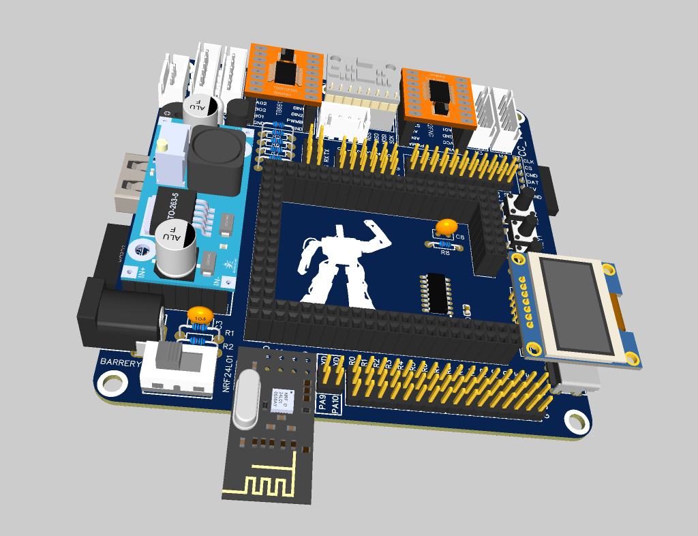

# alpha-4wd-board

- STM32F407ZGT6 核心板
- 1 个 MPU6050 模块
- 1 个 LM2596S 模块
- 2 个 TB6612FNG 模块
- 1 个 IIC/SPI OLED 接口
- 1 路 NRF24L01 接口
- 1 路 HC-SR04 接口
- 1 路 SPI 接口
- 1 路 Micro-USB 接口
- 4 路电机接口
- 1 个 RGB LED
- 3 个自定义按键
- 1 个无源蜂鸣器
- 1 路蓝牙接口
- 3 路扩展串口
- 1 路 PS2 手柄接收器接口
- 1 个 USB-A 5V 电源输出口
- 1 个红外接收头
- 6 路 ADC 接口
- 16 路 PWM 接口
- 其余 IO 全部引出
- 12V 直流电源